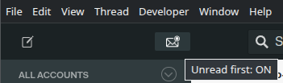

# 📦 Mailspring Toolbox

Mailspring Toolbox is my personal plugin that bundles small, focused productivity features for Mailspring.
Instead of many single-purpose plugins, Toolbox acts as a feature collection that can grow over time,
with each feature independently toggleable.

## Installation

- Clone the repository
- Build the plugin (or use pre-built version)
- Link or copy it into your Mailspring plugins directory
- Restart Mailspring

## Current features

### ✉️ Unread First – sort Inbox threads with unread messages first (Gmail-style)

**Unread First** changes the Inbox sort order so that unread threads are shown first, similar to Gmail.
Sorting applies only to Inbox, does not affect Sent, Trash, or Spam.

#### Enabling / disabling

Controlled via a toolbar toggle:

## Development

To get started, run `npm install` and then `npm run-script build`
to compile the `src` folder into the `lib` folder.

To see the changes in Mailspring, quit and relaunch the app
or open the Developer menu and use Reload menu item.
